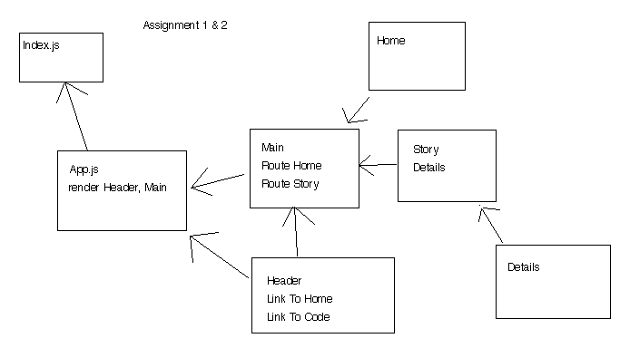
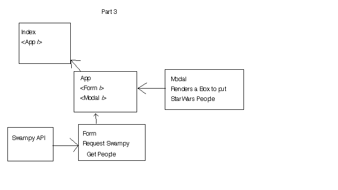

# Lab-29

## Project Name 
Routing and Component Composition

### Author: Student/Group Name: Ed

### Links and Resources
* [Warm-up](https://codesandbox.io/s/starter-codewarm-up-7m8br)
* [Story](https://codesandbox.io/s/starter-code-story-hws8p)
* [Functions](https://codesandbox.io/s/starter-code-function-x3wbk)
* [Modal](https://codesandbox.io/s/starter-codemodal-ly6qs)

#### UML

